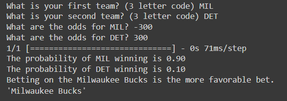
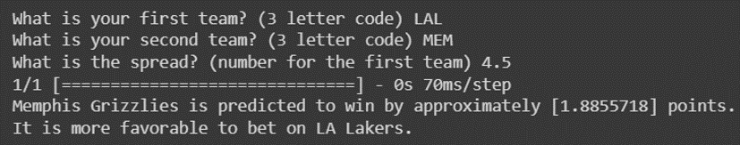

LEBRON (Line Evaluation Betting Research and Odds Navigator) is a chatbot that uses a machine learning model to predict the outcome of NBA games and give the user advice on how to make favorable sports bets, narrated by none other than LeBron James himself.

It was created in 24 hours for the HackAI 2023 hackathon with [Suvel Muttreja](https://github.com/suvelmuttreja) and [Wei-Chen Huang](https://github.com/weichenhuang1). I created the chatbot interface and the LangChain agent and integrated the voice narration, Suvel created the voice model and worked on the interface, and Wei-Chen trained and tested the betting model.

View the project on [Devpost](https://devpost.com/software/l-e-b-r-o-n) or the source code on [GitHub](https://github.com/romanhauksson/lebron).

## demo

import VimeoEmbed from "../../../components/VimeoEmbed.astro"

<VimeoEmbed videoId="919836629"/>

## tech stack

I built the chatbot frontend using [React](https://react.dev/) and the [`react-chatbot-kit`](https://www.npmjs.com/package/react-chatbot-kit) package and connected it to a [LangChain](https://github.com/hwchase17/langchain) conversational agent which called [OpenAI's GPT-3 API](https://openai.com/product). Suvel cloned LeBron James' voice using [ElevenLabs](https://beta.elevenlabs.io/), and I used the resulting API to add narration to the chatbot interface.

Wei-Chen trained the sports betting model using [TensorFlow](https://www.tensorflow.org/) and attempted to create an interface for it using [FastAPI](https://fastapi.tiangolo.com/) but ultimately didn't have enough time. Because the chatbot is powered by LangChain, it would be relatively straightforward to add the model as a tool for the conversational agent.